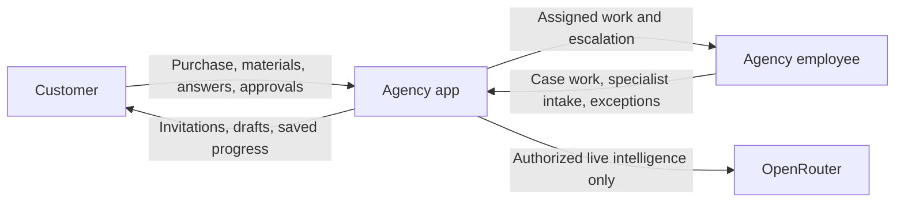
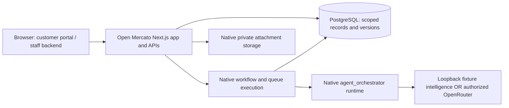

# Agency demo architecture

Start with the [presenter guide](guide.md) for commands and the walkthrough.
This is a C4-inspired orientation, not a claim that every drawn connection has
passed the latest end-to-end run. Modules below are logical components of one
Open Mercato application, not independent microservices.

## Context: who uses it?

The customer owns business answers and approvals. Employees handle genuine
exceptions and authorized setup. Agents produce judgments and documents; their
outputs are not payment confirmation, client consent, or permission to publish.

## Containers: what actually runs?

The server accepts scoped requests; native workflow activities and workers perform
durable work and persist results. Queue execution may run in separate worker
processes; the fixture runner drains the same native jobs under test control.
Attachments remain behind native access checks, not public file URLs.

In **fixture mode**, local intelligence responses and recorded source material
replace external model/source calls. Authentication, authorization, Sales orders
and zero-charge test payments, attachments, producers, QA, workflow transitions,
document persistence and explicit human decisions remain real.
In **live mode**, the native runtime uses centrally configured OpenRouter and
authorized budgets. Paid execution is opt-in and is not proved by fixture runs.
Neither mode turns a prompt or a model response into permission to act.

## Components: who owns which work?

| Component | Responsibility / public seam |
| --- | --- |
| `agency` | Teammate customer portal: purchase, materials, conversation and exact-version review UI/API. |
| `agency_operations` | Cases, purchase/material handoffs, native process configuration, client routing (G), review invitations and employee exceptions (E). Calls scoped public services. |
| `agency_research` | Teammate evidence/audit/findings, brief, strategy, pair QA, planning, post author/editor and persisted document projections through `agencyResearchService`. |
| `agency_tov` | Sole voice producer: corpus analysis, author profiles and brand synthesis yield the authoritative saved KLI-TOV version. |
| Open Mercato native modules | Identity/ACL, Sales/payment gateway, attachments, workflows/UserTasks, queues, agent execution and run records. No parallel agency runtime. |

The strategy continuation **orchestrates and consumes** specialist output. Its
[case-bound activity](../ai-company/apps/mercato/src/modules/agency_operations/lib/strategyExecution/activity.ts)
resolves the saved specialist reference, then calls `runStrategy` with that exact
version. Missing corpus/output produces an actionable wait; completion resumes
the same case. Strategy may author strategy, but cannot rewrite ToV or substitute
another voice writer. Pair review and downstream work must use that same version.
See [ADR-003](../.dev-docs/adr/003-agency-worker-and-interaction-map.md) for the durable boundary.

## Intended primary walkthrough and decision gates

1. Customer signs up, verifies identity and accepts the displayed demo offer/terms.
   Native test payment creates one paid case; no real money is charged.
2. Customer uploads private material. Authorized native analysis runs the teammate
   evidence, audit, findings and QA stages, then produces a reviewable brief.
3. When answers are needed, the original customer response goes through G to the
   real revision producer and fresh QA. The customer explicitly accepts the brief.
4. Staff supply the case-bound specialist corpus when needed. `agency_tov` produces
   its saved voice document; strategy consumes it and QA assesses the real pair.
   The customer explicitly accepts the exact strategy/ToV pair.
5. The teammate planning producer proposes a plan. Customer approval and selection
   of an actual topic create the deterministic post instruction.
6. Real post author/editor and QA produce the client review. The customer accepts
   exact post content; change requests use their owned revision path.
7. Exact-target publication configuration and **separate** publication consent are
   distinct from content acceptance. Preparation remains `canSend:false`: this
   demo does not send a Discord message or publish content.

These are gates, not automatic approvals. Missing input/configuration can wait;
repairable QA issues return to their producer within its bounds. An exhausted or
unrepairable outcome becomes owned employee work, not fabricated success.
Employees use native tasks and case views to inspect, ask a scoped client question,
or take a supported continuation; no generic override silently approves documents.
Recovery branches belong in separate demonstrations, not forced into the happy path.

## What is proved, and what is still being joined?

An earlier fixture journey proved the connected purchase/materials/research,
brief answers and revision, approvals, strategy/pair, plan/topic, post and preparation
flow **at its earlier source version**. It did not prove live-model quality or the
new sole-specialist ToV path. Do not present that prior pass as a latest-code pass.

T97/T98 specialist intake/reference and strategy continuation passed 174 focused
checks and app typechecking; complete native specialist-to-pair proof remains pending.
T100 navigation passed 38 focused checks, not a new full browser journey.
T95/T96 are unifying fixture/live journey selection and observed integration
evidence. Implemented code, source-ready handoffs, focused checks and a complete
runtime demonstration are different claims.

The [source map](../.dev-docs/integrations/expected.json) is an evolving snapshot, not a
required agent-call checklist. Its legacy registered-agent count includes a
competing `agency_research.tov_writer` being retired. `agency_tov.source_scout`
is conditional and not yet connected to the primary app journey. New registrations
and recovery agents must not be forced through the happy path to raise a count.

Use the [integration report](../.dev-docs/integrations/generated/generated-report.html)
and [its interpretation](../.dev-docs/integrations/usage.md) to separate source connections
from actual fixture/live observations and unobserved handoffs. Use the
[story coverage report](../.dev-docs/coverage/generated-report.html) and
[coverage guide](../.dev-docs/coverage/usage.md) for recorded acceptance-criterion coverage.
Neither task totals nor registered/executed-agent ratios are a product-completion
or remaining-effort percentage. Read the run/version behind each claim.
